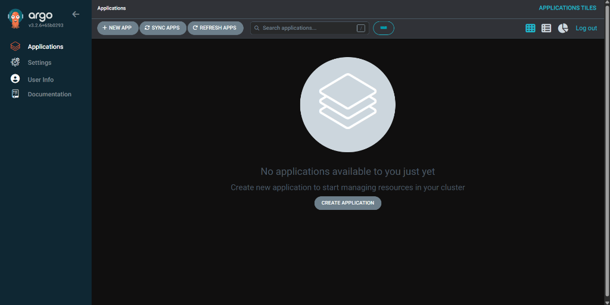

# Internal Developer Platform (IDP)


> **A Reference Implementation of a Modern Platform Engineering Stack**

This repository contains a complete, production-inspired Internal Developer Platform (IDP) designed to enable self-service for developers while maintaining strict governance, security, and operability standards.

## 🏗 Architecture

The platform is built on the **CNCF landscape** and follows strict **GitOps** principles.

| Component | Technology | Purpose |
|-----------|------------|---------|
| **Portal** | [Backstage](https://backstage.io) | Developer Self-Service & Catalog |
| **GitOps** | [Argo CD](https://argo-cd.readthedocs.io/) | Continuous Delivery & State Management |
| **Secrets** | [HashiCorp Vault](https://www.vaultproject.io/) | Enterprise Secrets Management |
| **Policy** | [Kyverno](https://kyverno.io/) | Governance & Policy-as-Code |
| **Observability** | [Prometheus](https://prometheus.io/) / [Grafana](https://grafana.com/) | Metrics & Dashboards |

👉 **[Read the full Architecture Documentation](docs/architecture.md)**

## ✨ Capabilities

*   **Self-Service Scaffolding**: Create new services (Go, Node.js, Python) in seconds via Backstage templates.
*   **Golden Paths**: Pre-configured CI/CD pipelines and Helm charts that are secure by default.
*   **GitOps-Driven**: All platform configuration and application deployments are managed via Git.
*   **Guardrails**: Policies enforce security best practices (e.g., no root containers, required labels) automatically.
*   **Day 2 Operations**: Built-in observability dashboards, automated drift detection, and centralized logging.

## 🚀 Getting Started

### Prerequisites

*   [Docker](https://www.docker.com/)
*   [Kind](https://kind.sigs.k8s.io/) or a valid Kubeconfig
*   [Helm](https://helm.sh/)
*   [kubectl](https://kubernetes.io/docs/tasks/tools/)

### Quick Start (Local)

1.  Clone this repository:
    ```bash
    git clone https://github.com/benslimamahdi/Internal-Developer-Platform-IDP-.git
    cd Internal-Developer-Platform-IDP-
    ```

1.  Bootstrap the local cluster (PowerShell):
    ```powershell
    .\scripts\bootstrap-cluster.ps1
    ```

3.  Access the Platform (via Port Forwarding):
    *   **Argo CD:** `https://localhost:8080` (User: `admin`, Password: see script output)
    *   **Backstage:** `http://localhost:7007`
    *   **Grafana:** `http://localhost:3000`

    *(See `docs/screenshot_guide.md` for specific verification steps)*

## 📸 Platform Gallery

| **Control Plane (Argo CD)** | **Developer Portal (Backstage)** |
|:---:|:---:|
|  |  |
| *GitOps automated sync* | *Self-service templates* |

| **Observability (Grafana)** | **Security (Kyverno)** |
|:---:|:---:|
|  |  |
| *Real-time metrics* | *Active Policy Enforcement* |

## 📂 Repository Structure

```
idp-platform/
├── docs/                 # Architectural Decision Records (ADRs) and guides
├── platform/             # Infrastructure-as-Code for platform services (Argo, Vault, etc.)
├── templates/            # Backstage Software Templates for new apps
├── demo-apps/            # Sample applications running on the platform
└── scripts/              # Automation for bootstrapping and maintenance
```

## 🤝 Why This Matters

In modern DevOps, "Platform Engineering" shifts the focus from simple CI/CD pipelines to building a **Product** for internal developers. This IDP demonstrates how to bind disparate tools into a cohesive experience that reduces proper cognitive load and accelerates Time-to-Market.

## ⚠️ Trade-offs & Limitations

*   **Complexity**: Running a full IDP (Vault, Backstage, etc.) requires significant resources. Local dev requires Docker with at least 8GB RAM allocated.
*   **Opinionated**: This repo makes specific technology choices (e.g., Kyverno over OPA) which might not fit every organization.

---
*Maintained by Mahdi Benslima*
